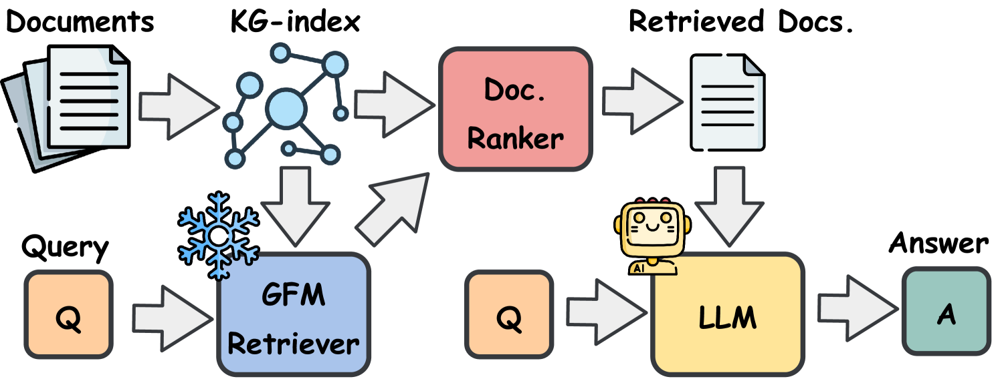

# GFM-RAG: Graph Foundation Model for Retrieval Augmented Generation
<div align="left">
   <p>
   <a href='https://rmanluo.github.io/gfm-rag/'></a>
   <a href='https://www.arxiv.org/abs/2502.01113'></a>
    <a href='https://www.arxiv.org/abs/2509.24276'></a>
   <a href='https://huggingface.co/collections/rmanluo/gfm-rag-67a1ef7bfe097a938d8848dc'></a>
    <a href='https://huggingface.co/collections/rmanluo/g-reasoner'></a>
  <a href="https://pypi.org/project/gfmrag/">
  </p>
  <p>
  
  <a href="https://pypi.org/project/gfmrag/">
    
  </a>
  <a href="https://pypi.org/project/gfmrag/">
    
  </a>
  <a href="https://github.com/RManLuo/gfm-rag/issues">
    
  </a>
  <a href="https://github.com/RManLuo/gfm-rag/discussions">
    
  </a>
  </p>
</div>

[\[中文解读\]](https://rman.top/2025/03/01/gfm-rag/)

The GFM-RAG is the first graph foundation model-powered RAG pipeline that combines the power of graph neural networks to reason over graphs and retrieve relevant documents for question answering.



We first build a graph-index from the documents to capture the relationships between knowledge. Then, we feed the query and constructed graph-index into the pre-trained graph foundation model (GFM) retriever to obtain relevant documents for LLM generation. The GFM retriever experiences large-scale training and can be directly applied to unseen datasets without fine-tuning.

GFM-RAG is designed to be efficient and generalizable. You can bring your own dataset and directly apply the pre-trained GFM retriever to obtain relevant documents for question answering. You can also fine-tune the GFM retriever on your own dataset to improve performance on specific domains.

For more details, please refer to our [project page](https://rmanluo.github.io/gfm-rag/) and [paper](https://www.arxiv.org/abs/2502.01113).

## 🎉 News
- **[2026-04-20]** We have released the G-reasoner codebase and a [34M pre-trained model](https://huggingface.co/rmanluo/G-reasoner-34M). 🚀
- **[2026-01-27]** We are excited to share that [G-reasoner](https://arxiv.org/abs/2509.24276) has been accepted by [ICLR 2026](https://iclr.cc/Conferences/2026).
- **[2025-10-01]** Checkout our latest progress: [G-reasoner: Foundation Models for Unified Reasoning over Graph-structured Knowledge](https://arxiv.org/abs/2509.24276). Code and model will be updated soon.
- **[2025-09-19]** We are excited to share that [GFM-RAG](https://www.arxiv.org/abs/2502.01113) has been accepted by [NeurIPS 2025](https://neurips.cc/Conferences/2025).
- **[2025-06-03]** We have released a new version of [GFM-RAG (2025-06-03)](https://huggingface.co/rmanluo/GFM-RAG-8M/commit/62cf6398c5875af1c4e04bbb35e4c3b21904d4ac) which is pre-trained on 286 KGs. Performance comparison with the previous version can be found in [CHANGELOG](docs/CHANGELOG.md).
- **[2025-02-06]** We have released the GFM-RAG codebase and a [8M pre-trained model](https://huggingface.co/rmanluo/GFM-RAG-8M). 🚀

## Features

- **Graph Foundation Model (GFM)**: A graph neural network-based retriever that can reason over the KG-index.
- **Knowledge Graph Index**: A knowledge graph index that captures the relationships between knowledge.
- **Efficiency**: The GFM-RAG pipeline is efficient in conducting multi-hop reasoning with single-step retrieval.
- **Generalizability**: The GFM-RAG can be directly applied to unseen datasets without fine-tuning.
- **Transferability**: The GFM-RAG can be fine-tuned on your own dataset to improve performance on specific domains.
- **Compatibility**: The GFM-RAG is compatible with arbitrary agent-based framework to conduct multi-step reasoning.
- **Interpretability**: The GFM-RAG can illustrate the captured reasoning paths for better understanding.

## Dependencies

- Python 3.12
- CUDA 12 and above (CUDA 12.6.3 is recommended)

## Installation

Conda provides an easy way to install the CUDA development toolkit which is required by GFM-RAG

Install packages
```bash
conda create -n gfmrag python=3.12
conda activate gfmrag
conda install cuda-toolkit -c nvidia/label/cuda-12.6.3 # Replace with your desired CUDA version
pip install gfmrag
```

## Quick Start

> [!NOTE]
> Read the full documentation at: https://rmanluo.github.io/gfm-rag/

This section shows the smallest end-to-end retrieval example:

1. Provide a dataset in `raw/`
2. Let `GFMRetriever.from_index(...)` build stage1 automatically if needed
3. Call `retriever.retrieve(...)` to get documents

For the full data schema, including pre-built `processed/stage1/`, see [gfmrag/workflow/README.md](gfmrag/workflow/README.md).

### Prepare A Minimal Raw Dataset

Create the following directory:

```text
data/
└── toy_raw/
    └── raw/
        ├── documents.json
        └── test.json (Optional)
```

#### `raw/documents.json`

`raw/documents.json` is the raw document corpus used to build the graph index.
It must be a JSON object where:

- each key is a document title or document id
- each value is the plain-text content of that document

Example:

```json
{
  "France": "France is a country in Western Europe. Paris is its capital. The president of France is Emmanuel Macron.",
  "Paris": "Paris is the capital and most populous city of France.",
  "Emmanuel Macron": "Emmanuel Macron is a French politician who has served as president of France since 2017."
}
```

#### `raw/test.json` (optional)

`raw/test.json` is optional for retrieval itself, but useful for storing example queries or later evaluation.
It must be a JSON array. Each item should contain:

- `id`: unique sample id
- `question`: the input query

It can also contain task metadata such as:

- `answer`: reference answer
- `answer_aliases`: optional aliases of the answer
- `supporting_documents`: document titles that support the answer

Example:

```json
[
  {
    "id": "toy-1",
    "question": "Who is the president of France?",
    "answer": "Emmanuel Macron",
    "answer_aliases": ["Macron"],
    "supporting_documents": ["France", "Emmanuel Macron"]
  }
]
```

### Retrieve Documents With `GFMRetriever`

The example below follows the same initialization path used in [gfmrag/gfmrag_retriever.py](gfmrag/gfmrag_retriever.py) and [gfmrag/workflow/qa_ircot_inference.py](gfmrag/workflow/qa_ircot_inference.py).

Save the script below as `quickstart_retrieve.py` in the repository root:

```python
import json

import hydra
from hydra.utils import instantiate
from omegaconf import DictConfig

from gfmrag import GFMRetriever


@hydra.main(
    config_path="gfmrag/workflow/config/gfm_rag",
    config_name="qa_ircot_inference",
    version_base=None,
)
def main(cfg: DictConfig) -> None:
    cfg.dataset.root = "./data"
    cfg.dataset.data_name = "toy_raw"

    ner_model = instantiate(cfg.graph_retriever.ner_model)
    el_model = instantiate(cfg.graph_retriever.el_model)
    graph_constructor = instantiate(cfg.graph_constructor)

    retriever = GFMRetriever.from_index(
        data_dir=cfg.dataset.root,
        data_name=cfg.dataset.data_name,
        model_path="rmanluo/G-reasoner-34M",  # or rmanluo/GFM-RAG-8M
        ner_model=ner_model,
        el_model=el_model,
        graph_constructor=graph_constructor,
    )

    results = retriever.retrieve("Who is the president of France?", top_k=5)

    print(results)


if __name__ == "__main__":
    main()
```


On the first run, `GFMRetriever.from_index(...)` will use `raw/documents.json` to build `processed/stage1/` automatically if the stage1 graph files do not already exist.

> [!NOTE]
> The default workflow configs used above rely on external models and services:
> - `ner_model: llm_ner_model`
> - `openie_model: llm_openie_model`
> - `el_model: colbert_el_model`
>
> In particular, the default NER/OpenIE setup uses OpenAI API-backed components, so make sure the corresponding credentials are available in your environment before running the example.

## GFM Fine-tuning

During fine-tuning, the GFM model will be trained on the query-documents pairs `train.json` from the labeled dataset to learn complex relationships for retrieval.

It can be conducted on your own dataset to improve the performance of the model on your specific domain.

An example of the training data:

```json
[
  {
    "id": "5abc553a554299700f9d7871",
    "question": "Kyle Ezell is a professor at what School of Architecture building at Ohio State?",
    "answer": "Knowlton Hall",
    "supporting_documents": ["Knowlton Hall", "Kyle Ezell"],
    "start_nodes": {
      "entity": [
        "kyle ezell",
        "architectural association school of architecture",
        "ohio state"
      ]
    },
    "target_nodes": {
      "document": ["Knowlton Hall", "Kyle Ezell"],
      "entity": [
        "10 million donation",
        "2004",
        "architecture",
        "austin e  knowlton",
        "austin e  knowlton school of architecture",
        "bachelor s in architectural engineering"
      ]
    }
  },
    ...
]
```

You need to create a [configuration file](gfmrag/workflow/config/gfm_rag/sft_training.yaml) for fine-tuning.

> [!NOTE]
> We have already released the two pre-trained model checkpoint [GFM-RAG-8M](https://huggingface.co/rmanluo/GFM-RAG-8M) and [G-reasoner-34M](https://huggingface.co/rmanluo/G-reasoner-34M), which can be used for further finetuning. The model will be automatically downloaded by specifying it in the configuration.
> ```yaml
> load_model_from_pretrained: rmanluo/G-reasoner-34M # or rmanluo/GFM-RAG-8M
> ```

Details of the configuration parameters are explained in the [GFM-RAG Fine-tuning Configuration](https://rmanluo.github.io/gfm-rag/config/gfmrag_finetune_config/) page.

You can fine-tune the pre-trained GFM-RAG model on your dataset using the following command:

```bash
python -m gfmrag.workflow.sft_training --config-path config/gfm_reasoner
# Multi-GPU training
torchrun --nproc_per_node=4 -m gfmrag.workflow.sft_training --config-path config/gfm_reasoner
# Multi-node Multi-GPU training
torchrun --nproc_per_node=4 --nnodes=2 -m gfmrag.workflow.sft_training --config-path config/gfm_reasoner
```

## Reproduce Results reported in the paper

Please refer to the [Experiment](docs/experiment/overview.md) section for detailed reproduction instructions for both [GFM-RAG](docs/experiment/gfm_rag.md) and [G-Reasoner](docs/experiment/g_reasoner.md).

## Acknowledgements

We greatly appreciate the following repositories for their help to this project:

* [DeepGraphLearning/ULTRA](https://github.com/DeepGraphLearning/ULTRA): The ULTRA model is used as the base GNN model for the GFM retriever.
* [OSU-NLP-Group/HippoRAG](https://github.com/OSU-NLP-Group/HippoRAG): We get great inspiration from the KG construction process of HippoRAG.
* [microsoft/graphrag](https://github.com/microsoft/graphrag): We get great inspiration from the project design of GraphRAG.

## Citation

If you find this repository helpful, please consider citing our paper:

```bibtex
@inproceedings{
	luo2026greasoner,
	title={G-reasoner: Foundation Models for Unified Reasoning over Graph-structured Knowledge},
	author={Linhao Luo and Zicheng Zhao and Junnan Liu and Zhangchi Qiu and Junnan Dong and Serge Panev and Chen Gong and Thuy-Trang Vu and Gholamreza Haffari and Dinh Phung and Alan Wee-Chung Liew and Shirui Pan},
	booktitle={The Fourteenth International Conference on Learning Representations},
	year={2026},
	url={https://openreview.net/forum?id=zJm9nmoahk}
}
```

```bibtex
@article{luo2025gfmrag,
  title={GFM-RAG: Graph Foundation Model for Retrieval Augmented Generation},
  author={Luo, Linhao and Zhao, Zicheng and Haffari, Gholamreza and Phung, Dinh and Gong, Chen and Pan, Shirui},
  journal={NeurIPS 2025},
  year={2025}
}
```
